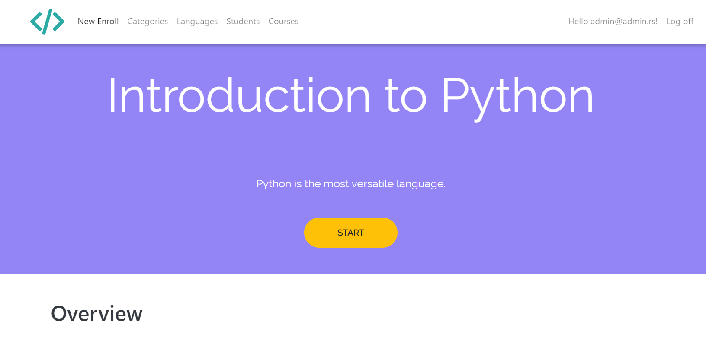

# LearningApp
The Learning App was created using ASP.NET MVC. It was imagined as a organizational tool for an educational company intended to manage(CRUD) students, categories, languages, courses using different user roles. 
 
 
 

